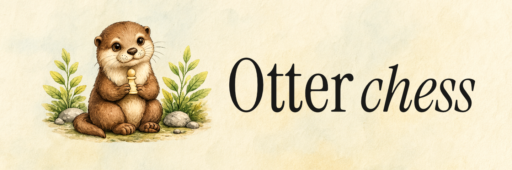

Otter is a skill-conditioned chess move prediction model. It predicts what move a player of a given Elo rating would make in a position, conditioned on game history, time control, and the remaining clock time.

This repository contains the `otter-chess` Python package, which exposes a clean API for local inference, alongside educational scripts illustrating the model architecture, training process, and validation pipelines.

[](https://pypi.org/project/otter-chess/)
[](https://pypi.org/project/otter-chess/)
[](LICENSE)

- **[Play in your browser](https://peargentlabs.github.io/otter-chess/play/)** — run the model client-side with WebGPU
- **[Paper](https://arxiv.org/abs/2608.05206)** — architecture, training, and evaluation details
- **[Model weights](https://huggingface.co/peargentlabs/otter-chess)** — `model.safetensors` and the ONNX export, on Hugging Face
- **[PyPI package](https://pypi.org/project/otter-chess/)** — `pip install otter-chess`
- **[Training report](https://api.wandb.ai/links/peargent-ai-labs/3mu4f1jv)** — runs, curves, and metrics on Weights & Biases

---

## Model Overview

The model features **15.3M parameters** and is trained jointly on three objectives:
- **Policy Head**: Predicts the next move (cross-entropy over 4,208 canonical UCI moves).
- **Value Head**: Predicts game outcome (MSE over $[-1, +1]$: win/loss/draw probability).
- **Auxiliary Head**: Predicts move attributes (moving piece, captured piece, check status, from/to squares).

### Architecture Highlights

- **Board Encoder**: CNN backbone with 4 residual blocks, dropout, and factored 2D position embeddings (rank + file).
- **History Encoder**: Last $K=20$ moves encoded via a 2-layer transformer.
- **Conditioning**: 640-dimensional vector combining active Elo, opponent Elo, time control, remaining clock, and pooled history.
- **Attention**: 1 skill-conditioned cross-attention block followed by 4 skill-conditioned self-attention blocks.

---

## Repository Structure

```text
otter-chess/
├── .github/
│   └── workflows/         # CI (lint/test) and PyPI publish (trusted publishing)
├── LICENSE                # MIT License
├── CITATION.cff           # Citation metadata
├── .gitignore             # Standard git excludes
├── docs/                  # Next.js web application & documentation
│   ├── app/               # Page routing (Home, Play Arena, Docs)
│   ├── public/            # Static weights & assets
│   └── package.json       # Web project dependencies
├── data_pipeline/         # Rust: PGN processing pipeline
│   ├── Cargo.toml         # Cargo configuration
│   ├── README.md          # Build & CLI usage
│   └── src/main.rs        # Exporter to convert PGN -> Parquet
├── data/
│   └── README.md          # Parquet schema & Elo band mapping (actual data is gitignored)
├── scripts/               # Training & validation scripts (for reference)
│   ├── requirements.txt   # Deps for these scripts only (not the library)
│   ├── train.py           # Model training loop
│   ├── data_loader.py     # Fastchess parquet streaming data loader
│   ├── inference.py       # Command line inference runner
│   ├── evaluate.py        # Standalone validation evaluator
│   └── export_onnx.py     # Exports the model to ONNX for browser inference
├── package/               # The published Python package (its own project root)
│   ├── pyproject.toml     # Packaging config & runtime dependencies
│   ├── README.md          # Rendered as the PyPI project page
│   └── otter_chess/       # Core library package code (import name)
│       ├── __init__.py    # Top-level API exports
│       ├── api.py         # OtterModel class (resolving weights & predicting)
│       ├── model.py       # PyTorch model components
│       └── vocab/         # Pre-built vocabulary mappings
└── tests/                 # pytest suite for package/otter_chess
```

---

## Installation

From PyPI:

```bash
pip install otter-chess
```

Or locally in editable mode — note the package root is `package/`, not the
repository root:

```bash
pip install -e ./package
```

### Dependencies
The package automatically installs only what the `otter_chess` library imports:
- `torch`
- `safetensors`
- `fastchess` (a custom high-performance C extension for chess operations)
- `numpy`

The training and export scripts need more than the library does. Those extras
(`pyarrow`, `wandb`) are listed separately in `scripts/requirements.txt`:

```bash
pip install -e ./package
pip install -r scripts/requirements.txt
```

---

## Python API Usage

The package exposes the `OtterModel` class.

### 1. Initializing the Model
The model will automatically resolve and cache the model weights (`model.safetensors`, downloaded from [Hugging Face](https://huggingface.co/peargentlabs/otter-chess)) on demand:

```python
from otter_chess import OtterModel

# Option A: Auto-resolve weights (checks cache ~/.cache/otter-chess/, then fallbacks, then downloads)
model = OtterModel()

# Option B: Pass a custom local weights file directly (.safetensors or .pt)
model = OtterModel(checkpoint_path="/path/to/my_weights.safetensors")

# Option C: Configure a custom remote download URL
model = OtterModel(download_url="https://huggingface.co/peargentlabs/otter-chess/resolve/main/model.safetensors")
```

### 2. Running Predictions
Use the `predict()` method to predict the next move:

```python
result = model.predict(
    fen="rnbqkbnr/pppppppp/8/8/8/8/PPPPPPPP/RNBQKBNR w KQkq - 0 1",
    player_elo=1800,       # Active player's Elo
    opponent_elo=1800,     # Opponent's Elo
    history_moves=["e2e4", "e7e5"],  # List of previous moves in the game
    time_control="600+0",  # Time control configuration
    clock_fraction=0.8,    # Remaining clock fraction (0.0 to 1.0)
    top_k=5                # Return top-5 move candidates
)

print(f"Predicted Win Probability: {result['win_probability']}")
for move in result['moves']:
    print(f"Move: {move['move']}, Probability: {move['probability']:.2%}")
```

### Prediction Output Format
The `predict()` method returns a dictionary:
```json
{
  "fen": "rnbqkbnr/pppppppp/8/8/8/8/PPPPPPPP/RNBQKBNR w KQkq - 0 1",
  "win_probability": -0.0906,
  "moves": [
    { "move": "e2e4", "probability": 0.3956 },
    { "move": "g1f3", "probability": 0.1854 }
  ],
  "aux_predictions": {
    "moving_piece": "Pawn",
    "moving_piece_confidence": 0.387,
    "captured_piece": "None",
    "captured_piece_confidence": 0.747,
    "results_in_check_probability": 0.0,
    "from_square": "e2",
    "from_square_confidence": 0.387,
    "to_square": "e4",
    "to_square_confidence": 0.239
  }
}
```

---

## Interactive Chess Web App (Next.js & WebGPU)

We provide a beautiful, dark-themed, glassmorphic Next.js web application that runs local client-side inference in your browser using **ONNX Runtime Web (WebGPU/WASM)**.

### Features
- **Home Hub**: Quick access to model attributes, repository stats, and W&B reports.
- **Play Arena**: Play chess against the model! It has:
  - Responsive vector SVG chess pieces with neon check highlights.
  - A real-time evaluation bar displaying the model's win/loss probability.
  - Interactive overlay popups to download and cache the 31MB ONNX model weights.
  - Model policy suggestions and auxiliary head prediction confidence scores.
- **Developer Docs**: An interactive documentation dashboard styled like a macOS code editor.

### Local Setup & Launch
1. **Navigate to the docs directory**:
   ```bash
   cd docs
   ```
2. **Install dependencies**:
   ```bash
   npm install
   ```
3. **Start the development server**:
   ```bash
   npm run dev
   ```
4. **Access the application** at [http://localhost:3000](http://localhost:3000).

---

## Data Preparation (Rust Pipeline)

Before training the model, you must process raw Lichess PGN game files (e.g. from `database.lichess.org`) into the structured Parquet training format using the Rust converter in `data_pipeline/`.

### 1. Build the Rust Pipeline
Ensure you have Rust and Cargo installed, then run:
```bash
cd data_pipeline
cargo build --release
```

### 2. Run the Exporter
Run the binary on a directory of `YYYY-MM.pgn.zst` Lichess dumps. This filters rapid games, calculates player Elo brackets, and exports partitioned Parquet files directly to the target `data/` directory:
```bash
./target/release/otter_pipeline /path/to/lichess_dumps ../data
```
Refer to [data_pipeline/README.md](data_pipeline/README.md) for full CLI details and [data/README.md](data/README.md) for the exact folder structures and Parquet schemas.

---

## Training and Validation (Python Scripts)

Once the training data is prepared, you can train or validate the model using the files inside the `scripts/` directory:

1. **`train.py`**:
   Trains the `StrongPolicyModel` model from streaming parquet shards.
   ```bash
   python scripts/train.py --train-months 2024-01 --val-months 2024-02 --train-steps 1000
   ```
2. **`evaluate.py`**:
   Evaluates a checkpoint on validation months.
   ```bash
   python scripts/evaluate.py --checkpoint /path/to/best.pt --val-months 2024-02
   ```
3. **`data_loader.py`**:
   Iterates through parquet game shards, canonicalizes positions and moves using `fastchess`, and constructs PyTorch tensors.

### Training Report & Metrics
Detailed training runs, validation curves, and metrics are documented in the [Weights & Biases Training Report](https://api.wandb.ai/links/peargent-ai-labs/3mu4f1jv).

---

## License

This project is licensed under the MIT License. See [LICENSE](LICENSE) for details.

## Citation

If you use this software, please cite it as follows:

```yaml
cff-version: 1.2.0
message: "If you use this software, please cite it as below."
authors:
  - given-names: Tarun
    affiliation: "Peargent Labs"
title: "Otter: A Skill-Conditioned Chess Move Prediction Model"
version: 0.1.0
date-released: 2026-07-07
```
